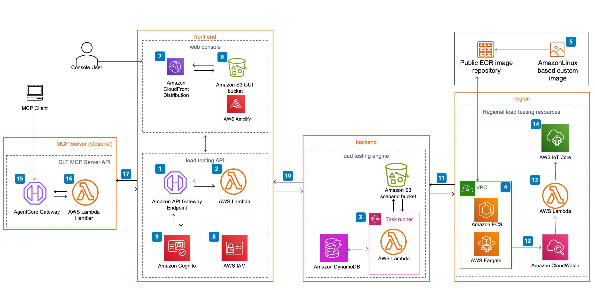

# Distributed Load Testing on AWS

The Distributed Load Testing Solution leverages managed, highly available and highly scalable AWS services to effortlessly create and simulate thousands of connected users generating a selected amount of transactions per second, originating from up to 5 simultaneous AWS regions. As a result, developers can understand the behavior of their applications at scale and at load to identify any bottleneck problems before they deploy to Production. [Launch in the AWS Console](https://console.aws.amazon.com/cloudformation/home?region=us-east-1#/stacks/new?&templateURL=https://solutions-reference.s3.amazonaws.com/distributed-load-testing-on-aws/latest/distributed-load-testing-on-aws.template&redirectId=GitHub)

## On this Page

- [Architecture Overview](#architecture-overview)
- [Deployment](#deployment)
- [Source Code](#source-code)
- [Creating a custom build](#creating-a-custom-build)

## Architecture Overview



The high-level process flow for the solution components deployed with the AWS CloudFormation template is as follows:  

1. A distributed load tester API, which leverages [Amazon API Gateway](https://aws.amazon.com/api-gateway) to invoke the solution's microservices ([AWS Lambda](https://aws.amazon.com/lambda) functions).

2. The microservices provide the business logic to manage test data and run the tests.

3. These microservices interact with [Amazon Simple Storage Service](https://aws.amazon.com/s3) (Amazon S3), [Amazon DynamoDB](https://aws.amazon.com/dynamodb), and [AWS Step Functions](https://aws.amazon.com/step-functions) to provide storage for the test scenario details and results and run test scenarios.

4. An [Amazon Virtual Private Cloud](https://aws.amazon.com/vpc) (Amazon VPC) network topology is deployed containing the solution\'s [Amazon Elastic Container Service](https://aws.amazon.com/ecs) (Amazon ECS) containers running on [AWS Fargate](https://aws.amazon.com/fargate).

5. The containers include the [AmazonLinux](https://aws.amazon.com/linux/amazon-linux-2023/) (with blazemeter load testing framework installed) [Open Container Initiative](https://opencontainers.org/) (OCI) compliant container image, which is used to generate load for testing your application\'s performance. Taurus/Blazemeter is an open-source test automation framework. The container image is hosted by AWS in an [Amazon Elastic Container Registry](https://aws.amazon.com/ecr) (Amazon ECR) public repository. For more information about the ECR image repository, refer to [Container image customization](https://docs.aws.amazon.com/solutions/latest/distributed-load-testing-on-aws/container-image.html).

6. A web console powered by [AWS Amplify](https://aws.amazon.com/amplify) is deployed it into an Amazon S3 bucket configured for static web hosting.

7. [Amazon CloudFront](https://aws.amazon.com/cloudfront) provides secure, public access to the solution\'s website bucket contents.

8. During initial configuration, this solution also creates a default solution administrator role (IAM role) and sends an access invite to a customer-specified user email address.

9. An [Amazon Cognito](https://aws.amazon.com/cognito) user pool manages user access to the console and the distributed load tester API.

10. After you deploy this solution, you can use the web console to create a test scenario that defines a series of tasks.

11. The microservices use this test scenario to run Amazon ECS on AWS Fargate tasks in the Regions specified.

12. In addition to storing the results in Amazon S3 and DynamoDB, once the test is complete the output is logged in [Amazon CloudWatch](https://aws.amazon.com/cloudwatch).

13. If you select the live data option, the solution sends the Amazon CloudWatch logs for the AWS Fargate tasks to a Lambda function during the test, for each Region in which the test was run.

14. The Lambda function then publishes the data to the corresponding topic in [AWS IoT Core](https://aws.amazon.com/iot-core) in the Region where the main stack was deployed. The web console subscribes to the topic, and you can see the data while the test runs in the web console.

## Deployment

The solution is deployed using a CloudFormation template with a lambda backed custom resource. To simulate users from regions other than the region the solution is initially deployed in, a regional template must be deployed within the other desired regions. For details on deploying the solution please see the details on the solution implementation guide: [Distributed Load Testing](https://docs.aws.amazon.com/solutions/latest/distributed-load-testing-on-aws/deployment.html).

## Source Code

**source/api-services**<br/>
A NodeJS Lambda function for the API microservices. Integrated with Amazon API Gateway, used to manage test scenarios.

**source/console**<br/>
ReactJS Single page application to provide a GUI to the solutions. Authenticated through Amazon Cognito this dashboard allows users to Create tests and view the final results.

**source/custom-resource**<br/>
A NodeJS Lambda function used as a CloudFormation custom resource for sending anonymized metrics, configuration for regional testing infrastructure, and iot configuration.

**source/infrastructure**<br/>
A Typescript [AWS Cloud Development Kit (AWS CDK)](https://aws.amazon.com/cdk/) [v2](https://docs.aws.amazon.com/cdk/v2/guide/home.html) package that defines the infrastructure resources to run the Distributed Load Testing on AWS solution.

It also uses the [AWS Solutions Constructs](https://aws.amazon.com/solutions/constructs/) [aws-cloudfront-s3](https://docs.aws.amazon.com/solutions/latest/constructs/aws-cloudfront-s3.html) package to define the CloudFront distribution and the S3 bucket that stores the content that makes up the UI.

**source/real-time-data-publisher**<br/>
A NodeJS Lambda function used to publish the real time load test data to an IoT topic.

**source/results-parser**<br/>
A NodeJS Lambda function used to write the xml output from the docker images to Amazon DynamoDB and generate the final results for each test.

**source/solution-utils**<br/>
A NodeJS package that contains commonly used functionality that is imported by other packages in this solution.

**source/task-canceler**<br/>
A NodeJS Lambda function used to stop tasks for a test that has been cancelled.

**source/task-runner**<br/>
A NodeJS Lambda function that runs the Amazon ECS task definition for each test.

**source/task-status-checker**<br/>
A NodeJS Lambda function that checks if the Amazon ECS tasks are running or not.

## Creating a custom build

The solution can be deployed through the CloudFormation template available on the solution home page: [Distributed Load Testing](https://aws.amazon.com/solutions/implementations/distributed-load-testing-on-aws/).

To make changes to the solution, download or clone this repository, update the source code and then run the deployment/build-s3-dist.sh script to deploy the updated Lambda code to an Amazon S3 bucket in your account.

### Prerequisites

- Node.js 20.x or later
- S3 bucket that includes the AWS region as a suffix in the name. For example, `my-bucket-us-east-1`. The bucket and CloudFormation stack must be in the same region. The solution's CloudFormation template will expect the source code to be located in a bucket matching that name.

### Running unit tests for customization

- Clone the repository and make the desired code changes.

```bash
git clone https://github.com/aws-solutions/distributed-load-testing-on-aws.git
cd distributed-load-testing-on-aws
export BASE_DIRECTORY=$PWD
```

- Run unit tests to make sure the updates pass the tests.

```bash
cd $BASE_DIRECTORY/deployment
chmod +x ./run-unit-tests.sh
./run-unit-tests.sh
```

### Building distributable for customization

- Configure the environment variables.

```bash
export REGION=aws-region-code # the AWS region to launch the solution (e.g. us-east-1)
export BUCKET_PREFIX=my-bucket-name # prefix of the bucket name without the region code
export BUCKET_NAME=$BUCKET_PREFIX-$REGION # full bucket name where the code will reside
export SOLUTION_NAME=my-solution-name
export VERSION=my-version # version number for the customized code
export PUBLIC_ECR_REGISTRY=public.ecr.aws/aws-solutions # replace with the container registry and image if you want to use a different container image
export PUBLIC_ECR_TAG=v3.4_stable # replace with the container image tag if you want to use a different container image
```

- Build the distributable.

```bash
cd $BASE_DIRECTORY/deployment
chmod +x ./build-s3-dist.sh
./build-s3-dist.sh $BUCKET_PREFIX $SOLUTION_NAME $VERSION
```

> **Note**: The _build-s3-dist_ script expects the bucket name **without the region suffix** as one of its parameters.

- Deploy the distributable to the Amazon S3 bucket in your account.

  - Make sure you are uploading the files in `deployment/global-s3-assets` and `deployment/regional-s3-assets` to `$BUCKET_NAME/$SOLUTION_NAME/$VERSION`.

- Get the link of the solution template uploaded to your Amazon S3 bucket.

- Deploy the solution to your account by launching a new AWS CloudFormation stack using the link of the solution template in Amazon S3.

## Creating a custom container build

This solution uses a public Amazon Elastic Container Registry (Amazon ECR) image repository managed by AWS to store the solution container image that is used to run the configured tests. If you want to customize the container image, you can rebuild and push the image into an ECR image repository in your own AWS account.
For details on how to customize the container image, please see the **Container image customization** section of the [implementation guide](https://docs.aws.amazon.com/solutions/latest/distributed-load-testing-on-aws/container-image.html).

## Collection of operational metrics

This solution collects anonymized operational metrics to help AWS improve the quality and features of the solution. For more information, including how to disable this capability, please see the [implementation guide](https://docs.aws.amazon.com/solutions/latest/distributed-load-testing-on-aws/operational-metrics.html).

---

Copyright Amazon.com, Inc. or its affiliates. All Rights Reserved.<br />
SPDX-License-Identifier: Apache-2.0
