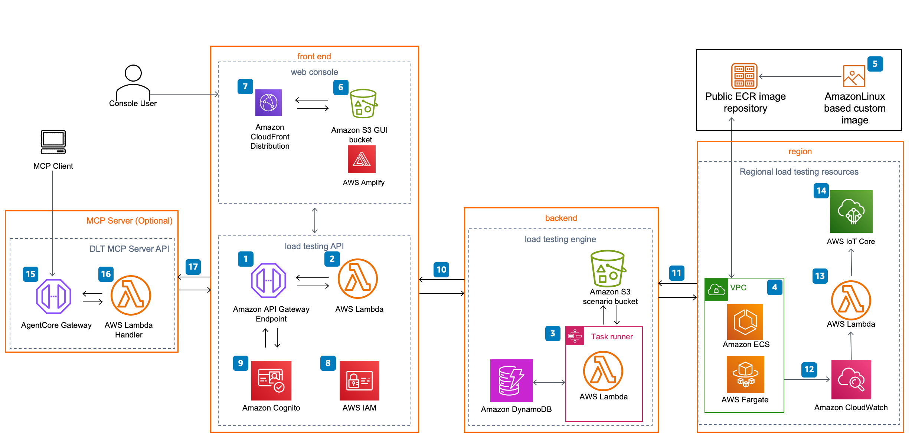

# Distributed Load Testing on AWS

Distributed Load Testing on AWS helps you automate performance testing of your software applications at scale to identify bottlenecks before you release your application. This solution simulates thousands of connected users generating HTTP requests at a sustained rate without the need to provision servers.

- Deploy Amazon ECS on AWS Fargate containers that run independently to test the load capacity of your application.
- Simulate tens of thousands of concurrent users across multiple AWS Regions generating requests at a continuous pace.
- Customize your application tests using [JMeter](https://jmeter.apache.org/), [K6](https://k6.io/), [Locust](https://locust.io/) test scripts, or simple HTTP endpoint configuration.
- Schedule load tests to run immediately, at a future date and time, or on a recurring schedule.
- Run multiple load tests concurrently across different scenarios and regions.

The intended audience for using this solution's features and capabilities in their environment includes IT infrastructure architects, administrators, and DevOps professionals who have practical experience architecting in the AWS Cloud. As a result, developers can understand the behavior of their applications at scale and at load to identify any bottleneck problems before they deploy to Production. [Launch in the AWS Console](https://console.aws.amazon.com/cloudformation/home?region=us-east-1#/stacks/new?&templateURL=https://solutions-reference.s3.amazonaws.com/distributed-load-testing-on-aws/latest/distributed-load-testing-on-aws.template&redirectId=GitHub)

## On this Page

- [Architecture Overview](#architecture-overview)
- [Deployment](#deployment)
- [Source Code](#source-code)
- [Local Development](#local-development)
- [Testing](#testing)
- [Creating a custom build](#creating-a-custom-build)

## Architecture Overview



Deploying this solution with the default parameters deploys the following components in your AWS account.

> **Note**: AWS CloudFormation resources are created from AWS Cloud Development Kit (AWS CDK) constructs.

The high-level process flow for the solution components deployed with the AWS CloudFormation template is as follows:

1. A distributed load tester API leverages [Amazon API Gateway](https://aws.amazon.com/api-gateway) to invoke the solution's microservices ([AWS Lambda](https://aws.amazon.com/lambda) functions).

2. The microservices provide the business logic to manage test data and run the tests.

3. These microservices interact with [Amazon Simple Storage Service](https://aws.amazon.com/s3) (Amazon S3), [Amazon DynamoDB](https://aws.amazon.com/dynamodb), and [AWS Step Functions](https://aws.amazon.com/step-functions) to store test scenario details and results and to orchestrate test execution.

4. An [Amazon Virtual Private Cloud](https://aws.amazon.com/vpc) (Amazon VPC) network topology deploys containing the solution's [Amazon Elastic Container Service](https://aws.amazon.com/ecs) (Amazon ECS) containers running on [AWS Fargate](https://aws.amazon.com/fargate).

5. The containers use an [Amazon Linux 2023](https://aws.amazon.com/linux/amazon-linux-2023/) base image with the [Taurus](https://gettaurus.org/) load testing framework installed. Taurus is an open-source test automation framework that supports JMeter, K6, Locust, and other testing tools. The container image is [Open Container Initiative](https://opencontainers.org/) (OCI) compliant and hosted by AWS in an [Amazon Elastic Container Registry](https://aws.amazon.com/ecr) (Amazon ECR) public repository. For more information, refer to [Container image customization](https://docs.aws.amazon.com/solutions/latest/distributed-load-testing-on-aws/container-image.html).

6. A web console powered by [AWS Amplify](https://aws.amazon.com/amplify) deploys into an S3 bucket configured for static web hosting.

7. [Amazon CloudFront](https://aws.amazon.com/cloudfront) provides secure, public access to the solution's website bucket contents.

8. During initial configuration, the solution creates a default administrator role (IAM role) and sends an access invite to a customer-specified user email address.

9. An [Amazon Cognito](https://aws.amazon.com/cognito) user pool manages user access to the console, the distributed load tester API, and the MCP Server.

10. After you deploy this solution, you can use the web console or APIs to create and run test scenarios that define a series of tasks.

11. The microservices use this test scenario to run ECS tasks on Fargate in the specified Regions.

12. When the test completes, the solution stores results in S3 and DynamoDB and logs output in [Amazon CloudWatch](https://aws.amazon.com/cloudwatch).

13. If you enable the live data option, the solution sends CloudWatch logs from the Fargate tasks to a Lambda function during the test for each Region where the test runs.

14. The Lambda function publishes the data to the corresponding topic in [AWS IoT Core](https://aws.amazon.com/iot-core) in the Region where the main stack was deployed. The web console subscribes to the topic and displays real-time data while the test runs.

### MCP Server Integration (Optional)

> **Note**: The following steps describe the optional MCP Server integration for AI-assisted load testing analysis. This component is only deployed if you select the MCP Server option during solution deployment.

15. An MCP client (AI development tool) connects to the [AWS AgentCore Gateway](https://aws.amazon.com/bedrock/agentcore/) endpoint to access the Distributed Load Testing solution's data through the Model Context Protocol. AgentCore Gateway validates the user's Cognito authentication token to ensure authorized access to the MCP server.

16. Upon successful authentication, AgentCore Gateway forwards the MCP tool request to the DLT MCP Server Lambda function. The Lambda function returns the structured data to AgentCore Gateway, which sends it back to the MCP client for AI-assisted analysis and insights.

17. The Lambda function processes the request and queries the appropriate AWS resources (DynamoDB tables, S3 buckets, or CloudWatch logs) to retrieve the requested load testing data.

## Deployment

The solution provides three deployment templates to suit different hosting requirements:

| Template                  | Description                                                                                                                             |
| ------------------------- | --------------------------------------------------------------------------------------------------------------------------------------- |
| Default (CloudFront + S3) | Web console served via CloudFront and S3. Suitable for most regions.                                                                    |
| ALB + ECS                 | Web console hosted behind an Application Load Balancer with ECS Fargate. For regions without CloudFront or secure network requirements. |
| Headless                  | No web console hosting. Backend services only, with console assets in S3 for self-hosting.                                              |

The solution can be deployed using either CloudFormation or AWS CDK:

**CloudFormation Deployment**: The solution is deployed using a CloudFormation template. To simulate users from regions other than the region the solution is initially deployed in, a regional template must be deployed within the other desired regions. For details on deploying the solution, see the [implementation guide](https://docs.aws.amazon.com/solutions/latest/distributed-load-testing-on-aws/deployment.html).

**AWS CDK Deployment**: For custom deployments and direct infrastructure-as-code management, the solution's infrastructure is developed with AWS CDK v2. See the [infrastructure README](source/infrastructure/README.md) for detailed CDK deployment instructions including prerequisites, bootstrapping, and deployment of all stack variants.

## Source Code

**source/api-services**<br/>
A NodeJS Lambda function for the API microservices. Integrated with Amazon API Gateway, used to manage test scenarios.

**source/build-tools**<br/>
Custom build scripts and utilities used for building and packaging the solution.

**source/cli**<br/>
A TypeScript command-line interface for headless interaction with the DLT solution. Supports three authentication modes (browser OAuth/PKCE, SRP headless, and IAM), and provides commands to manage test scenarios, query run results, download artifacts from S3, and inspect token status. Designed for both interactive developer use and CI/CD integration. See [source/cli/README.md](source/cli/README.md) for full documentation.

**source/custom-resource**<br/>
A NodeJS Lambda function used as a CloudFormation custom resource for sending operational metrics to AWS, configuration for regional testing infrastructure, and iot configuration.

**source/infrastructure**<br/>
A Typescript [AWS Cloud Development Kit (AWS CDK)](https://aws.amazon.com/cdk/) [v2](https://docs.aws.amazon.com/cdk/v2/guide/home.html) package that defines the infrastructure resources to run the Distributed Load Testing on AWS solution.

It also uses the [AWS Solutions Constructs](https://aws.amazon.com/solutions/constructs/) [aws-cloudfront-s3](https://docs.aws.amazon.com/solutions/latest/constructs/aws-cloudfront-s3.html) package to define the CloudFront distribution and the S3 bucket that stores the content that makes up the UI.

**source/integration-tests**<br/>
Integration tests for the solution, including API tests and end-to-end console tests using Cypress. Includes comprehensive test suites for validating deployed solution functionality.

**source/metrics-utils**<br/>
A TypeScript package containing utilities for operational metrics collection and reporting used across the solution.

**source/real-time-data-publisher**<br/>
A NodeJS Lambda function used to publish the real time load test data to an IoT topic.

**source/results-parser**<br/>
A NodeJS Lambda function used to write the xml output from the docker images to Amazon DynamoDB and generate the final results for each test.

**source/solution-utils**<br/>
A NodeJS package that contains commonly used functionality that is imported by other packages in this solution.

**source/task-canceler**<br/>
A NodeJS Lambda function used to stop tasks for a test that has been cancelled.

**source/task-runner**<br/>
A NodeJS Lambda function that runs the Amazon ECS task definition for each test.

**source/task-status-checker**<br/>
A NodeJS Lambda function that checks if the Amazon ECS tasks are running or not.

**source/webui**<br/>
React-based single page application that provides the web console interface for the solution. Built with Cloudscape Design System, Redux for state management, and AWS Amplify for authentication. Authenticated through Amazon Cognito, this dashboard allows users to create tests and view results.

**source/mcp-server**<br/>
A TypeScript package that implements the Model Context Protocol (MCP) server for AI-assisted load testing analysis. Provides structured access to DLT data through AWS AgentCore Gateway.

## Local Development

For developers working on the solution locally, this section provides step-by-step instructions for setting up and deploying DLT from source code.

### Prerequisites

- Node.js 24.x or later
- AWS CLI configured with appropriate credentials
- Docker (for container image builds)

### Environment Setup

1. **Create environment configuration**:

   ```bash
   cp .env.example .env
   ```

2. **Configure your `.env` file** with your specific values:

   ```bash
   # CDK Parameters
   TARGET_REGION=us-east-1                    # Your primary deployment region
   MAIN_STACK_NAME=distributed-load-testing-on-aws
   REGIONAL_STACK_NAME=distributed-load-testing-on-aws-regional

   # Stack Parameters
   ADMIN_NAME=your_username                   # Admin username (no spaces)
   ADMIN_EMAIL=your-email@example.com         # Admin email address
   ```

### Main Stack Deployment

1. **Install dependencies**:

   ```bash
   make install-deps
   ```

2. **Deploy the main stack**:

   ```bash
   make deploy
   ```

   > **Note**: This automatically builds web and JMeter assets before deploying.

3. **Run the web app locally**:
   ```bash
   make dev
   ```

### Regional Stack Management

To enable load testing from multiple regions, you can deploy regional stacks that contain the testing infrastructure (ECS clusters, VPC, etc.). The `regional-deploy` target automatically bootstraps CDK in the target region if needed.

1. **Deploy regional stack**:

   ```bash
   make regional-deploy REGION=us-west-2
   ```

2. **Deploy to multiple regions**:
   ```bash
   make regional-deploy REGION=eu-west-1
   make regional-deploy REGION=ap-southeast-1
   ```

### Regional Stack Version Compatibility

The hub stack validates that each regional (spoke) stack is running a compatible version before allowing a test to proceed. Two rules are enforced:

1. The regional stack version must be greater than or equal to the minimum compatible version declared in `regional-compatibility.json`.
2. The regional stack version must be less than or equal to the hub stack version. This enforces a hub-first upgrade order since the hub builds the regional CloudFormation template.

If a test targets an incompatible region, the API rejects the request with a descriptive error and writes a failed test run to the history table so the failure is visible in the web console.

**When to bump `minimumCompatibleVersion`**: Update the `minimumCompatibleVersion` field in `regional-compatibility.json` when a release introduces a change that requires redeployment of regional stacks. Examples include changes to the ECS task definition, the container image or `load-test.sh` entrypoint, ECS cluster configuration, networking resources, or the DynamoDB schema written by the regional custom resource.

**How to bump**: Edit `regional-compatibility.json` at the repo root and set `minimumCompatibleVersion` to the version that introduces the breaking change.

```json
{
  "minimumCompatibleVersion": "4.1.0"
}
```

**Upgrade order**: Always deploy the hub stack first (or simultaneously with regional stacks). The hub generates the regional CloudFormation template, so regional stacks deployed after a hub upgrade will use the latest template. Existing regional stacks must be redeployed to pick up the changes.

### Available Make Targets

- `make help` - Show available commands and usage information
- `make install-deps` - Install all project dependencies
- `make dev` - Run web UI locally (requires deployed stack)
- `make deploy` - Deploy the main DLT stack (builds web and JMeter assets automatically)
- `make diff` - Preview stack changes before deployment
- `make changeset` - Create CloudFormation changeset for review
- `make regional-deploy REGION=<region>` - Deploy regional stack (auto-bootstraps CDK in target region)

### Development Workflow

1. **Initial Setup**:

   ```bash
   cp .env.example .env
   # Edit .env with your values
   make install-deps
   make deploy
   # Update .env with stack outputs
   ```

2. **Add Regional Testing Capacity**:

   ```bash
   make regional-deploy REGION=us-west-2
   ```

3. **Local Development**:
   ```bash
   make dev  # Starts local development server
   ```

### Notes

- Regional stacks automatically register themselves with the main stack and will appear in the web console
- Each regional stack creates independent testing infrastructure in the specified region
- The main stack must be deployed before any regional stacks
- Regional stacks can be deployed to the same region as the main stack or different regions

## Testing

The solution includes comprehensive testing capabilities:

**Unit Tests**: Run unit tests for all components using the provided script:

```bash
cd deployment
chmod +x ./run-unit-tests.sh
./run-unit-tests.sh
```

## Creating a custom build

The solution can be deployed through the CloudFormation template available on the solution home page: [Distributed Load Testing](https://aws.amazon.com/solutions/implementations/distributed-load-testing-on-aws/).

To make changes to the solution, download or clone this repository, update the source code and then run the deployment/build-s3-dist.sh script to deploy the updated Lambda code to an Amazon S3 bucket in your account.

### Prerequisites

- Node.js 24.x or later
- S3 bucket that includes the AWS region as a suffix in the name. For example, `my-bucket-us-east-1`. The bucket and CloudFormation stack must be in the same region. The solution's CloudFormation template will expect the source code to be located in a bucket matching that name.

### Running unit tests for customization

- Clone the repository and make the desired code changes.

```bash
git clone https://github.com/aws-solutions/distributed-load-testing-on-aws.git
cd distributed-load-testing-on-aws
export BASE_DIRECTORY=$PWD
```

- Run unit tests to make sure the updates pass the tests.

```bash
cd $BASE_DIRECTORY/deployment
chmod +x ./run-unit-tests.sh
./run-unit-tests.sh
```

### Building distributable for customization

- Configure the environment variables.

```bash
export REGION=aws-region-code # the AWS region to launch the solution (e.g. us-east-1)
export BUCKET_PREFIX=my-bucket-name # prefix of the bucket name without the region code
export BUCKET_NAME=$BUCKET_PREFIX-$REGION # full bucket name where the code will reside
export SOLUTION_NAME=my-solution-name
export VERSION=my-version # version number for the customized code (must contain a valid semver, e.g. v4.1.0 or custom-v4.1.0)
export PUBLIC_ECR_REGISTRY=public.ecr.aws/aws-solutions # replace with the container registry and image if you want to use a different container image
export PUBLIC_ECR_TAG=v4.1_stable # replace with the container image tag if you want to use a different container image
```

- Build the distributable.

```bash
cd $BASE_DIRECTORY/deployment
chmod +x ./build-s3-dist.sh
./build-s3-dist.sh $BUCKET_PREFIX $SOLUTION_NAME $VERSION
```

> **Note**: The _build-s3-dist_ script expects the bucket name **without the region suffix** as one of its parameters.

> **Note**: The `VERSION` parameter must contain a valid semantic version pattern (`MAJOR.MINOR.PATCH`, e.g. `v4.1.0`, `custom-v4.1.0`, or `v4.1.0-ITL`). The script will reject values that don't match this format and warn if the version doesn't align with the `solutionVersion` in `source/infrastructure/cdk.json`.

- Deploy the distributable to the Amazon S3 bucket in your account.
  - Make sure you are uploading the files in `deployment/global-s3-assets` and `deployment/regional-s3-assets` to `$BUCKET_NAME/$SOLUTION_NAME/$VERSION`.

- Get the link of the solution template uploaded to your Amazon S3 bucket.

- Deploy the solution to your account by launching a new AWS CloudFormation stack using the link of the solution template in Amazon S3.

## Creating a custom container build

This solution uses a public Amazon Elastic Container Registry (Amazon ECR) image repository managed by AWS to store the solution container image that is used to run the configured tests. If you want to customize the container image, you can rebuild and push the image into an ECR image repository in your own AWS account.
For details on how to customize the container image, please see the **Container image customization** section of the [implementation guide](https://docs.aws.amazon.com/solutions/latest/distributed-load-testing-on-aws/container-image.html).

## Third-party testing frameworks

This solution includes [Apache JMeter](https://jmeter.apache.org/) 5.6.3 as one of its supported load testing engines. JMeter 5.6.3 has known security vulnerabilities that cannot be fully patched externally due to compatibility constraints with the Taurus test automation framework. DLT distributes JMeter without modification.

Customers are responsible for evaluating whether JMeter 5.6.3 meets their security requirements. You can supply a patched JMeter binary in your test archive or replace individual plugin JARs using the plugin override mechanism. See [docs/jmeter.md](docs/jmeter.md) for details on security considerations and patching options, and the [Apache JMeter security page](https://jmeter.apache.org/security.html) for current advisories.

## Collection of operational metrics

This solution sends operational metrics to AWS (the “Data”) about the use of this solution. We use this Data to better understand how customers use this solution and related services and products. AWS’s collection of this Data is subject to the [AWS Privacy Notice](https://aws.amazon.com/privacy/).

---

Copyright Amazon.com, Inc. or its affiliates. All Rights Reserved.<br />
SPDX-License-Identifier: Apache-2.0
